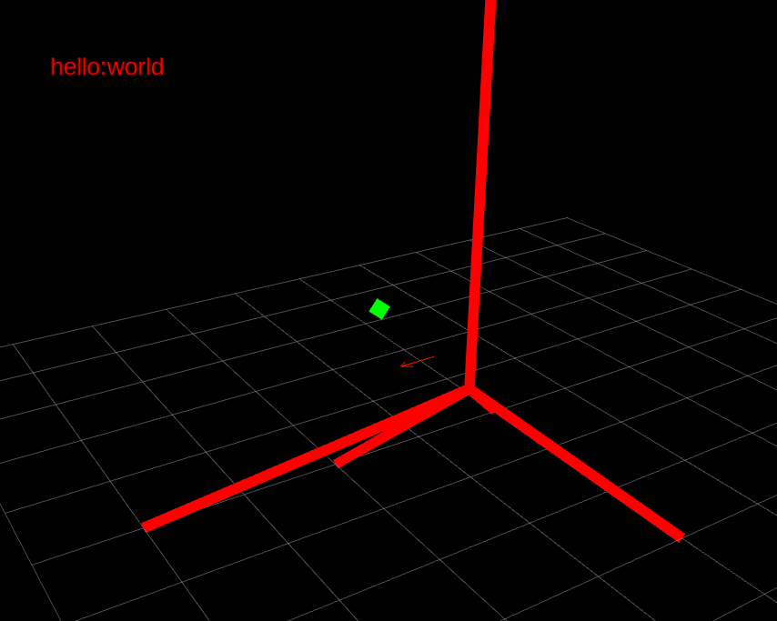

# Easy Debug Visualizer For Every Project

This is a simple debug visualizer for every project as long as it can write files, which can generate 3D geometries simultaneously. remote files are also supported.

## Dependencies

* ros

## Usage

* You can customize your config.py
* You need modify sample.launch
* The format is shown in sample/sample.txt

